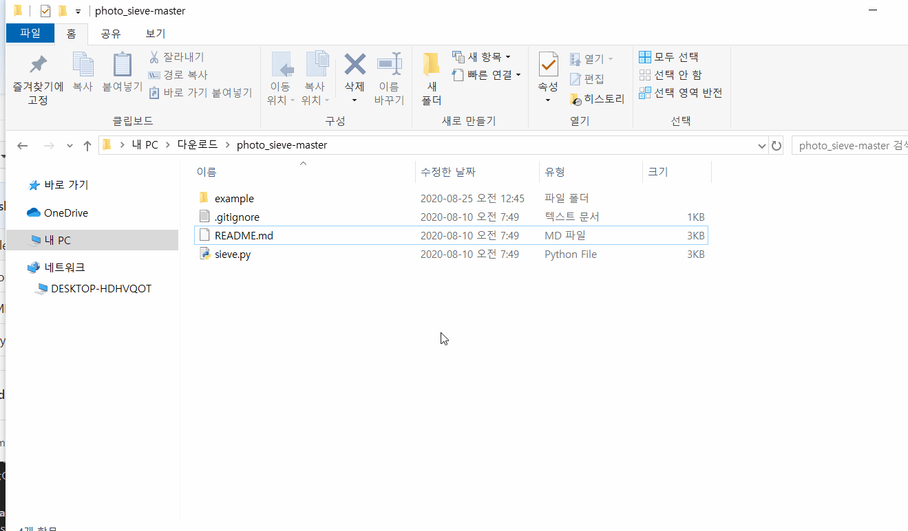
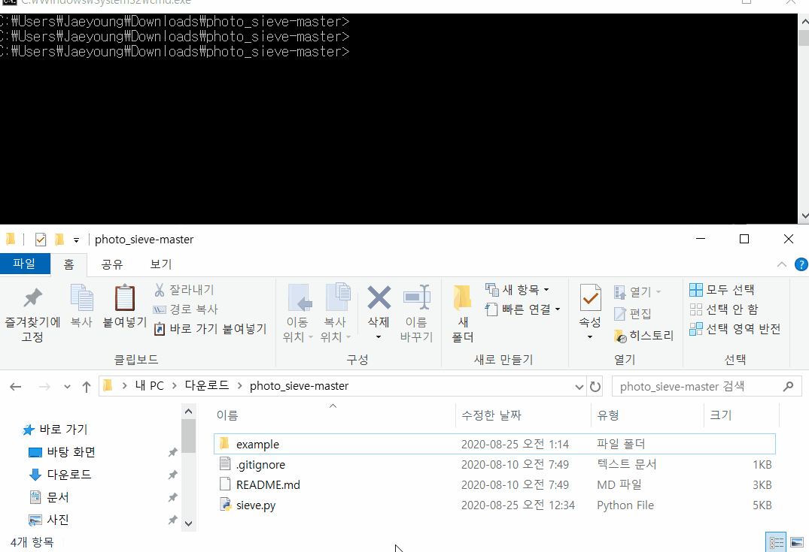
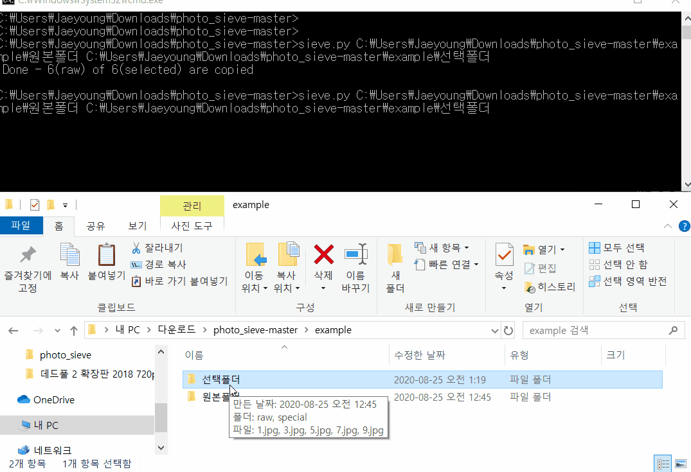

# PHOTO SIEVE
선택된 압축 형식 사진 파일(ex. jpg)에 대한 원본(ex. NEF) 파일을 찾아 복사해 주는 유틸리티. 아래 가이드는 Mac, Window10 기준으로 작성되었다. 

# Preequsites

#### 1. python 
사전에 아래 프로그램이 설치 되어야한다. 만약 설치가 안되었다면 아래 site를 방문하여 설치하도록 한다.
- [python3](https://www.python.org/downloads/) 


# 사용 방법

## 1. 프로그램을 다운로드 받는다. 
이 page의 상단에 으로 이동하여 아래 그림과 같이 "Downalod Zip" 버튼을 눌러 프로그램을 다운로드 받아 원하는 위치에 압축을 풀어준다. 


## 2. Command 실행 창을 연다.
아래와 같이 파일탐색기로 프로그램의 위치로 이동한후, 위치 창에 "cmd"라고 입력하여 command prompt를 실행한다. 



## 3. 프로그램을 실행한다.
프로그램의 이름은 `sieve.py`이고 아래 2개의 폴더를 입력으로 받는다. 
1. 원본 폴더 - 원본 파일이 있는 폴더
2. 선택 폴더 - 고객이 선택한 인코딩된 형식의 파일이 있는 폴더(.jpg)

아래과 같이 프로그램 실행을 위해서는 프로그램 이름, `원본폴더`와 `선택폴더`를 차례로 입력 한다. 파일탐색기에서 Drag&Drop으로도 가능하며, 순서와 띄어 쓰기에 유의한다. 

```
>sieve.py 원본폴더 선택폴더
```

아래 예제에서는 프로그램과 함께 제공된 예제 폴더를 사용하여 설명하였다.



## 4. 결과 확인한다. 
명령이 수행 되면 그 결과로 몇장의 사진이 복사 되었는지, 어떤 파일이 누락 되었는지 간단한 상태를 확인 할 수 있다. 원하는 결과가 나왔는지 로그를 통해 먼저 확인한다. 

결과에 문제가 없다면 `선택폴더` 내에 `raw` 폴더가 생성되어 있고, 폴더를 열어보면 원하는 Raw 포맷의 파일들이 복사 되어 있는 것을 확인할 수 있다. 

